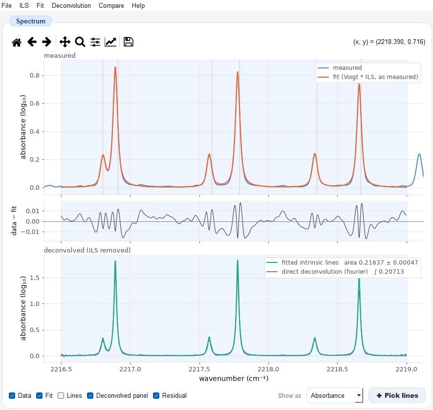
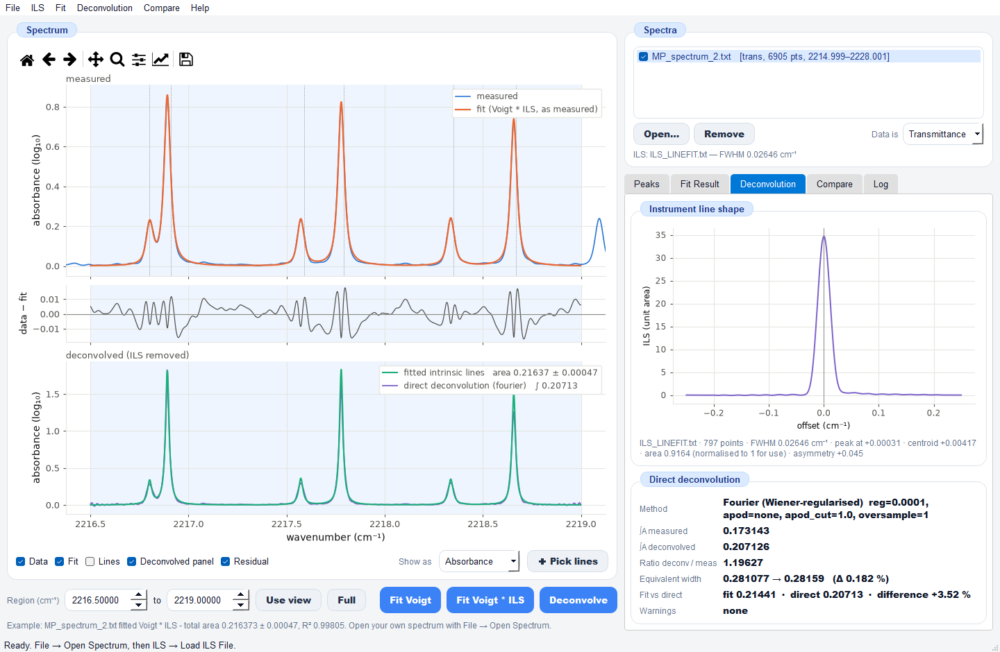

# Voigt Fit

Voigt-profile fitting, instrument-line-shape (ILS) deconvolution and area
comparison for high-resolution absorption spectra (e.g. FTIR spectra of
N₂O in a multipass cell). 

The instrument line shape is removed in two independent ways, and their
agreement is reported:

* **Deconvolution by fitting (Voigt * ILS)**: Voigt lines convolved with the
  measured ILS are fitted to the data; the fitted lines without the ILS are the
  deconvolved spectrum, with parameter and area uncertainties.
* **Direct deconvolution**: the ILS is divided out of the measured spectrum
  without a line model (Wiener-regularised Fourier, or Richardson–Lucy).

## The GUI (`Voigt_GUI.py`)

`python Voigt_GUI.py` opens with a worked example already fitted and deconvolved.
The measured spectrum and the Voigt * ILS fit (top), the residual (middle) and the
deconvolved spectrum (bottom) share one wavenumber axis:



The *Deconvolution* tab shows the ILS, the measured and deconvolved areas, the
equivalent-width self-check and the fit-vs-direct agreement:



The *Compare* tab integrates the area of every loaded spectrum and reports ratios
and differences to a reference

## What it can do

| Task | How |
|---|---|
| **Read spectra** | Two-column text (MATLAB exports, HITRAN simulations, CSV) **and Bruker OPUS binary files** (`.dpt`, `.0`, `.1`, …) directly. Transmittance or absorbance, guessed per file and switchable. Any number of spectra at once. |
| **Fit Voigt lines** | Sum of Voigt profiles fitted by trust-region-reflective least squares (the algorithm `fit2voigt.m` used with `lsqnonlin`). Bounds on the Gaussian and Lorentzian widths, optional fixed positions/widths, optional constant or linear baseline, robust loss functions. |
| **Starting lines** | Load a MATLAB `par0` file, detect peaks automatically, or click on the plot to add lines. Edit them in a table; save them back as `par0`. |
| **Use your instrument line shape** | Load a measured ILS (e.g. LINEFIT's `ILS_LINEFIT.txt`), build one from LINEFIT modulation/phase parameters (`ilsparms.dat`), or use a synthetic sinc (max OPD) or Gaussian (FWHM). |
| **Deconvolve by fitting** | *Fit Voigt * ILS*: the Voigt model is convolved with the ILS before it is compared with the data, so the fitted lines **are** the deconvolved spectrum, with parameter and area uncertainties. |
| **Deconvolve directly** | Model-free: regularised (Wiener, λ = 1e-4 by default) Fourier deconvolution with optional apodisation, Richardson–Lucy iteration, or the 2020 MATLAB algorithm reproduced exactly. |
| **Integrate areas** | Analytic Voigt line areas with uncertainties propagated through the full covariance (GUM matrix method); trapezoidal ∫A dν of measured, fitted and deconvolved spectra; equivalent width ∫(1−T) dν. |
| **Compare spectra** | Area of each spectrum, ratio and % difference to a chosen reference (with propagated uncertainty), overlay plot, CSV export. Batch "Deconvolve all" and "Fit all". |
| **Export** | Results as CSV/JSON, fitted and deconvolved curves as text columns, plots as PNG/SVG/PDF (300 dpi). |

## Installation

Python 3.9 or newer.

```
python -m venv .venv
.venv\Scripts\activate          # Windows   (source .venv/bin/activate on Linux/macOS)
pip install -r requirements.txt
```

Dependencies: numpy, scipy, matplotlib, PyQt5.

## Quick start

```
python Voigt_GUI.py
```

The window opens with a **worked example already fitted**: `Input/MP_spectrum_2.txt`
(N₂O, multipass cell) with the LINEFIT ILS `Input/ILS_LINEFIT.txt` and the six
starting lines `Input/par0_test.txt`, over 2216.5–2219 cm⁻¹. It is fitted
Voigt * ILS with the Gaussian width fixed at the N₂O Doppler width (total area
0.2164 ± 0.0005, R² = 0.998) and deconvolved directly (area 0.2071 in the region;
the fitted lines give 0.2144 in the same region, +3.5 %), so you always have a
known-good result to compare against.

Other ways to start:

```
python Voigt_GUI.py my_spectrum.txt other.dpt   # open these instead of the example
python Voigt_GUI.py --no-example                # start empty
python Voigt_GUI.py --selftest                  # numerical checks, no window
```

**Help → Load Example** reloads the example at any time; **File → Data Settings →
Start-up** switches it off.

## Typical workflow

1. **File → Open Spectrum** (several files at once is fine). Tick the ones you want to compare.
2. **ILS → Load ILS File** (or *From LINEFIT Parameters* / *Synthetic ILS*).
3. Set the **Region** under the plot (type it, or zoom and press *Use view*).
4. Get starting lines: **Detect**, **✚ Pick lines** on the plot, or **Load par0…**.
5. **Fit Voigt * ILS** → the *Fit Result* tab shows each line ± error and the total area.
6. **Deconvolve** → the *Deconvolution* tab shows the measured vs deconvolved area
   and the equivalent-width self-check.
7. **Copy to all spectra** (Peaks tab), then **Compare → Fit all / Deconvolve all**,
   then **Compare** to get the area table and ratios against the reference.
8. **File → Save Result / Export Curves / Save Plot**.

### The plot

Three panels share one wavenumber axis:

* **measured**: the data, the fit as the instrument sees it, and optionally the individual lines;
* **data − fit**: the residual;
* **deconvolved (ILS removed)**: the fitted intrinsic lines and the direct deconvolution, each labelled with its area.

## Where the settings are

Each setting lives in the menu whose work it affects:

| Menu | Settings |
|---|---|
| File → Data Settings | transmittance/absorbance, absorbance log base (10 or e), baseline normalisation, area-integration baseline, start-up example |
| ILS → ILS Settings | kernel centring (peak / centroid / zero), LINEFIT max OPD, synthetic ILS widths |
| Fit → Fit Settings | width bounds, Gaussian width with the ILS (Doppler from temperature and molecular mass, or free), position bounds, fixed parameters, baseline, convolution domain, loss, peak detection |
| Deconvolution → Deconvolution Settings | method, regularisation λ, apodisation, Richardson–Lucy iterations, oversampling |

Settings are kept in `Config/voigt_settings.json`; saved results go to `Results/` by default.

## Conventions

**Line parameters** (`par0`, a 4 × g matrix, as in the MATLAB code): row 1 position ν₀ (cm⁻¹),
row 2 intensity s, row 3 Gaussian HWHM a_G, row 4 Lorentzian HWHM a_L. One line is

    V(ν) = s · Re w(x + iy),   x = (ν − ν₀)·√ln2 / a_G,   y = √ln2 · a_L / a_G

where w is the Faddeeva function. Its area is exactly **s·√π·a_G / √ln2**.

**Absorbance** is A = log₁₀(1/T) by default (as in `voigtfit_test.m`); the 2020
deconvolution script used ln(1/T). Areas in base e are 2.3026 × those in base 10.

**Which area to use.** A unit-area ILS does not change the equivalent width
∫(1−T) dν, but it *does* reduce the integrated absorbance ∫A dν of saturated
lines. The deconvolved ∫A dν is the quantity proportional to line strength ×
column density, which is what you normally compare between spectra. The fitted
*total* area integrates the lines over all wavenumbers; the region integrals stop
at the region edges, so leave room for the line wings.

**Gaussian width with and without the ILS.** *Fit Voigt* (no ILS) uses the
`fit2voigt.m` bounds 0.0104–0.0105 cm⁻¹: there the Gaussian also has to stand
in for the instrument. *Fit Voigt * ILS* fixes the Gaussian at the Doppler HWHM
ν₀·√(2 ln2 kT / mc²), about 0.0021 cm⁻¹ for N₂O at 296 K, because the
instrument is already in the ILS; using the 0.0105 bound there counts the
instrument twice and underestimates the deconvolved area by ~5 % (tested on a
synthetic spectrum). Set the temperature and molecular mass in Fit Settings.

**Fit vs direct deconvolution.** The Deconvolution tab reports both areas over
the same region. On a Doppler-limited synthetic spectrum seen through
`ILS_LINEFIT.txt` both recover the true area to within 0.1 %. On the example
spectrum they differ by about 3.5 %, because a pure Voigt shape seen through this
ILS does not reproduce the measured line cores exactly (see the residual
panel): small unmodelled lines, or an ILS that differs slightly from the one
in force during the measurement, are the likely causes.

**The ILS** is normalised to unit area and centred at its maximum before use. The
convolution acts on the transmittance by default (exact for deep lines);
convolving the absorbance (`fadderiv.m`'s approach) is available as the weak-line
approximation. Spectra should be on a near-uniform grid with spacing well below
the ILS FWHM.

**Uncertainties** come from s²(JᵀJ)⁻¹ at the solution and describe the noise of
that fit, not systematic errors in the ILS or the baseline.

## Files

```
Voigt_GUI.py           the desktop application (PyQt5)
voigt_core.py          Faddeeva function (port of fadf.m), Voigt profile, areas, widths
voigt_fit.py           fit2voigt (port of fit2voigt.m) and the general fitter fit_voigt,
                       peak detection, uncertainties
ils.py                 ILS sampling and convolution, LINEFIT/sinc/Gaussian ILS,
                       ports of ils_conv.m, fadderiv.m and fft_ils.m
deconvolution.py       Fourier (Wiener), Richardson–Lucy, and the 2020 algorithm
                       (port of deconvolution_code_200909.m)
area_compare.py        area integration and comparison between spectra
spectrum_io.py         text and Bruker OPUS readers, ILS and par0 files
voigtfit_test.py       port of voigtfit_test.m (script, matplotlib figure)
deconvolution_test.py  port of deconvolution_code_200909.m's six-panel figure
requirements.txt
GUI.png, docs/         screenshots used in this README
Input/
  MP_spectrum_2.txt         N₂O multipass-cell transmittance (the example spectrum)
  NB_N2O-22_64scan-cut.txt  N₂O spectrum used by deconvolution_test.py
  ILS_LINEFIT.txt           LINEFIT instrument line shape (offset cm⁻¹, value)
  ilsparms.dat              LINEFIT modulation efficiency / phase error parameters
  par0_test.txt             six starting lines for the example
```

The modules depend on each other in one direction:
`spectrum_io`, `voigt_core` → `ils` → `voigt_fit`, `deconvolution` → `area_compare` → `Voigt_GUI`.
Each can be used on its own from Python, e.g.

```python
import numpy as np
from spectrum_io import load_spectrum, load_ils, load_par0, to_absorbance
from voigt_fit import fit_voigt

sp = load_spectrum("Input/MP_spectrum_2.txt")
ils = load_ils("Input/ILS_LINEFIT.txt")
m = (sp.x > 2216.5) & (sp.x < 2219)
r = fit_voigt(sp.x[m], to_absorbance(sp.y[m]), load_par0("Input/par0_test.txt"),
              {"use_ils": True}, ils=ils)
print(r["total_area"], "+-", r["total_area_err"])
```

## Self-test

`python Voigt_GUI.py --selftest` checks the Faddeeva port against
`scipy.special.wofz` (agreement ~1e-14), the analytic area, recovery of known lines
from a synthetic spectrum blurred by an ILS (area recovered within 0.1 σ), the
direct deconvolution (within 0.05 % of the true area, equivalent width conserved),
and the example data.

## Credits

* Faddeeva function: S. M. Abrarov and B. M. Quine, York University (`fadf.m`).
* `fit2voigt.m`: M. Ruzi, La Trobe Institute for Molecular Sciences, La Trobe University.
* If you find this source code useful, please feel free to use it. If you do, please remember to cite the following paper:
  Trisna, B. A., Park, S., Park, I., Lee, J., & Lim, J. S. (2023). Measurement report: Radiative efficiencies of \(\text{(CF}_3\text{)}_2\text{CFCN}\), CF₃OCFCF₂, and CF₃OCF₂CF₃. Atmospheric Chemistry and Physics, 23(8), 4489–4500. https://acp.copernicus.org/articles/23/4489/2023/acp-23-4489-2023.pdf


